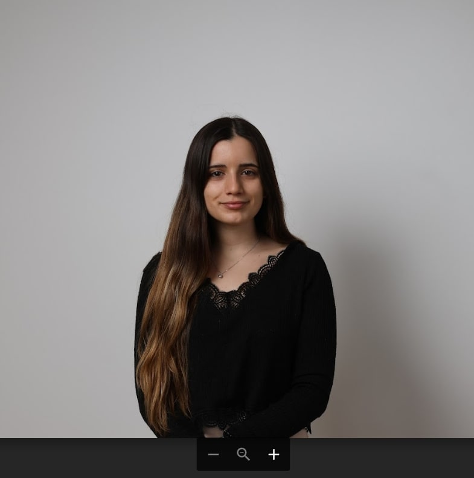

## About Me

I am a PhD candidate in Computer Science at the <a target="_blank" href="https://ciencias.ulisboa.pt/">Faculty of Sciences of the University of Lisbon</a> (FCUL), conducting research at <a target="_blank" href="https://www.lasige.pt/">LASIGE</a>. I am supervised by <a target="_blank" href="http://www.di.fc.ul.pt/~catiapesquita/"> Dr. Catia Pesquita</a> from FCUL.

Interested in Biomedical Artificial Intelligence. I am currently focusing on Explainable AI, researching the application of AI algorithms to explain their decisions and the implementation of AI-driven technologies in the healthcare sector. My goal is to contribute to developing ethical and transparent AI technologies. More specifically, I am working on making deep learning-based drug recommendations for cancer patients more easily understood by clinicians. 

I have previously conducted research in Multi-domain knowledge graph embeddings and Machine Learning algorithms for <a target="_blank" href="https://jbiomedsem.biomedcentral.com/articles/10.1186/s13326-023-00291-x">gene-disease association prediction</a>.

Currenty conducting research on <a target="_blank" href="https://liseda-lab.github.io/assets/pdf/2024ECAI_XAI.pdf"> Drug Repurposing Hypothesis Validation with Knowledge-infused Explanations </a>.

For a more thorough and structured description of my work, you may check <a target="_blank" href="https://drive.google.com/drive/folders/1DWkvD6oqcchaHkJS0OUlh5ECjM4u1_ER?usp=sharing">my CV</a>.

Links:
  <a target="_blank" href="https://scholar.google.com/citations?hl=en&user=-lwlWq4AAAAJ"><i class="fas fa-graduation-cap"></i></a> ⚭
  <a target="_blank" href="https://www.lasige.pt/member/susana-nunes/"><i class="fab fa-orcid"></i></a> ⚭
  <a target="_blank" href="https://github.com/SusanaPNunes"><i class="fab fa-github"></i></a> ⚭
  <a target="_blank" href="https://www.linkedin.com/in/susana-cpnunes/"><i class="fab fa-linkedin"></i></a>

## Research Interests

I am interested in many topics beyond these and always look forward to collaborations. If you have a problem you would like to collaborate on, feel free to [contact me](#contact).

* Explainable AI
* Machine Learning
* Deep Learning
* Semantic Similarity
* Knowledge Graphs and Ontologies
* Knowledge Graph Embeddings
* Large Language Models

## Experience 

### Sony AI - Internship

Assistant AI Researcher at Sony AI, Barcelona, Spain. Joined a team aimed at various breakthroughs in AI research, including the application of AI in the scientific domain. 

## Teaching

### Programming I, Faculty of Sciences of the University of Lisbon

Course focuses on programming fundamentals

### Outsystems - UPskill programme, Faculty of Sciences of the University of Lisbon

Teaching Theoretical-Practical classes to students without a technological background. Teaching them coding skills that will enable them to work on application software on low-code development platforms.

## Contact

You can contact me at: scnunes [at] ciencias.ulisboa.pt
