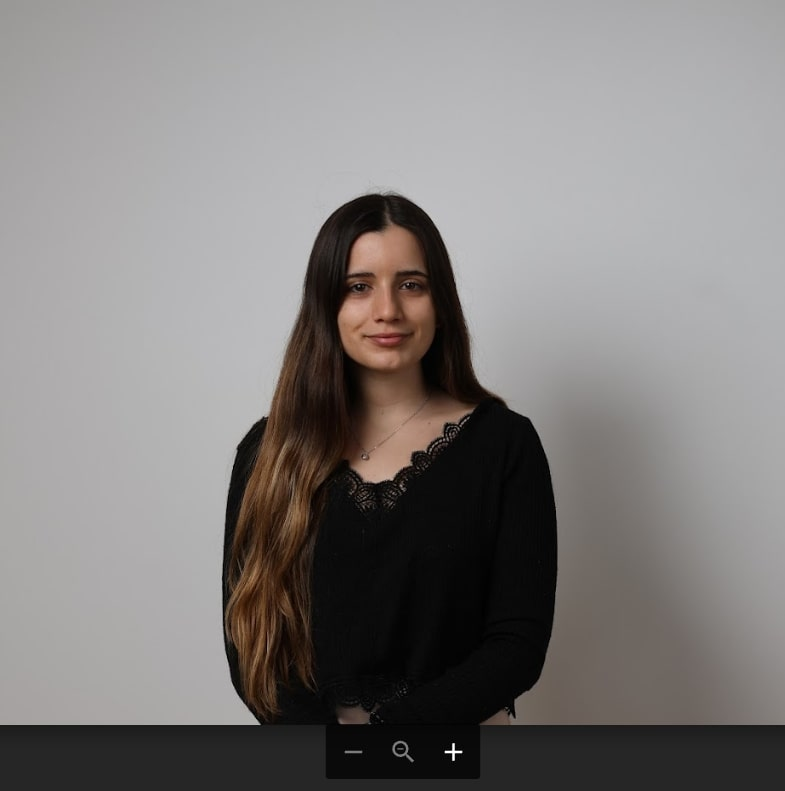

## About Me

I am a PhD researcher in Computer Science at the <a target="_blank" href="https://ciencias.ulisboa.pt/">Faculty of Sciences of the University of Lisbon</a> (FCUL), working at <a target="_blank" href="https://www.lasige.pt/">LASIGE</a> under the supervision of <a target="_blank" href="http://www.di.fc.ul.pt/~catiapesquita/">Dr. Cátia Pesquita</a>. I expect to defend my PhD in 2026.

My research sits at the intersection of **graph machine learning, neuro-symbolic and explainable AI, and large language models**, applied to **drug discovery and biomedical decision-making**. I build methods that don't just *predict* biomedical links — drug–disease, drug–target, gene–disease — over large knowledge graphs, but also *explain why* a prediction holds, in terms a domain expert can understand and act on. My goal is to develop trustworthy, transparent AI that helps clinicians and researchers turn model outputs into testable scientific hypotheses.

Previously, I was an Assistant AI Researcher at **Sony AI** in Barcelona, and I am a research fellow on the EU Horizon projects **KATY** and **CancerScan**. Earlier, I worked on multi-domain knowledge graph embeddings and machine learning for <a target="_blank" href="https://jbiomedsem.biomedcentral.com/articles/10.1186/s13326-023-00291-x">gene–disease association prediction</a>.

For a structured overview of my work, you can check <a target="_blank" href="https://drive.google.com/drive/folders/1DWkvD6oqcchaHkJS0OUlh5ECjM4u1_ER?usp=sharing">my CV</a>.

Links:
  <a target="_blank" href="https://scholar.google.com/citations?user=_vBEObEAAAAJ&hl=en&oi=sra"><i class="fas fa-graduation-cap"></i></a> ⚭
  <a target="_blank" href="https://www.lasige.pt/member/susana-nunes/"><i class="fab fa-orcid"></i></a> ⚭
  <a target="_blank" href="https://github.com/SusanaPNunes"><i class="fab fa-github"></i></a> ⚭
  <a target="_blank" href="https://www.linkedin.com/in/susana-cpnunes/"><i class="fab fa-linkedin"></i></a>

## Research Interests

I am interested in many topics beyond these and always look forward to collaborations. If you have a problem you would like to work on together, feel free to [contact me](#contact).

* Explainable AI (XAI) & neuro-symbolic AI
* Graph machine learning & link prediction
* Knowledge graphs, ontologies & knowledge graph embeddings
* Large language models & agentic systems
* Reinforcement learning
* Hypothesis generation for scientific discovery
* AI for drug discovery & biomedical applications

## Selected Publications

* **Rewarding Explainability in Drug Repurposing with Knowledge Graphs.** S. Nunes, S. Badreddine, C. Pesquita. *IJCAI 2025.* <a target="_blank" href="https://liseda-lab.github.io/assets/pdf/2025IJCAI_RewardingExplainability">[paper]</a>
* **Adaptive Scientific Explanations through Agentic Personas.** S. Nunes, et al. *Under review, Nature Machine Intelligence, 2025.*
* **Multi-domain Knowledge Graph Embeddings for Gene–Disease Association.** S. Nunes, R. T. Sousa, C. Pesquita. *Journal of Biomedical Semantics, 2023.* <a target="_blank" href="https://jbiomedsem.biomedcentral.com/articles/10.1186/s13326-023-00291-x">[paper]</a>

A full list is available on <a target="_blank" href="https://scholar.google.com/citations?user=_vBEObEAAAAJ&hl=en">Google Scholar</a>.

## Experience

### Doctoral Researcher — LASIGE, University of Lisbon (2021–present)

Designing neuro-symbolic, knowledge-infused explainable-AI methods for AI-driven drug discovery, combining knowledge graphs, reinforcement learning, and large language models. Key contributions include **REx** (reinforcement-learning explanations over biomedical knowledge graphs), **agentic personas** (LLM-based personalisation of explanations), and **ADDEx** (an end-to-end explainable-AI platform for drug-development research).

### Research Fellow — EU Horizon & national projects (2021–present)

Contributing explainable-AI and knowledge-graph methods to **KATY** (Horizon 2020 — AI-empowered personalised medicine for cancer), **CancerScan** (Horizon Europe — patient-specific treatment recommendation in oncology), and **TrustAI4Sci** (FCT — trustworthy XAI for scientific discovery).

### Assistant AI Researcher — Sony AI, Barcelona (2024)

Six-month research internship: ontology-infused graph-embedding pre-training and constraint enforcement, and explainable AI for black-box models.

## Teaching

### Programming I — Faculty of Sciences of the University of Lisbon

Theoretical-practical classes on programming fundamentals (Python) for first-year students across seven bachelor programmes.

### OutSystems — UPskill programme, Faculty of Sciences of the University of Lisbon

Teaching theoretical-practical classes to students without a technological background, giving them the coding skills to build application software on low-code development platforms.

## Awards

* FCT Doctoral Studentship — competitive national fellowship (ref. 2023.00653.BD)
* 2nd place, Federated Learning Challenge, WideHealth Winter School 2023

## Contact

You can contact me at: scnunes [at] ciencias.ulisboa.pt
